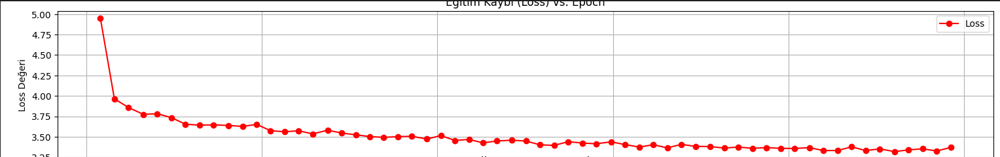
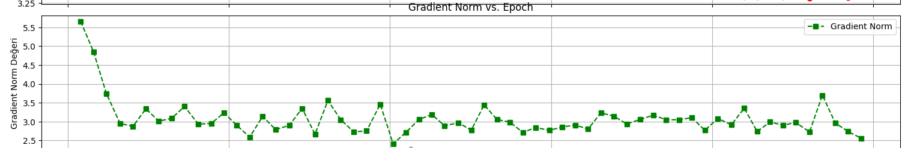
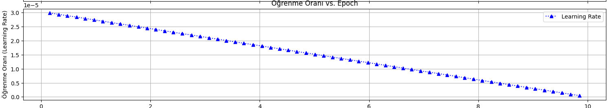

# 📜 Poetry Producer Gen Ai 📜

**Yapay zeka ile kendi şiirlerinizi yaratın!** Bu proje, Hugging Face `transformers` kütüphanesi ve `distilgpt2` modeli kullanılarak geliştirilmiş bir üretken yapay zeka uygulamasıdır. Geniş bir İngilizce şiir veri seti üzerinde ince ayar (finetuning) yapılarak eğitilen model, verdiğiniz bir başlangıç dizesinden ilham alarak yeni ve özgün şiirler üretir.

✨ **Modelimiz Hugging Face Hub'da:** [Emirhan05/distilgpt2-poetry-generation-ai](https://huggingface.co/Emirhan05/distilgpt2-poetry-generation-ai) ✨

Bu proje, üretken yapay zekanın gücünü API anahtarı veya ek maliyetler olmadan deneyimlemenizi sağlar.

## 🌟 Projenin Öne Çıkanları

- **Özelleştirilmiş Şiir Üretimi:** `distilgpt2` modelinin şiir veri setleriyle eğitilmesi sayesinde, model şiirsel dil ve yapıları öğrenir.
- **Etkileşimli Deneyim:** `Gradio` ile geliştirilen kullanıcı dostu web arayüzü sayesinde modelle kolayca etkileşim kurabilir ve şiirler üretebilirsiniz.
- **Derinlemesine Kontrol:** Üretilen şiirlerin uzunluğunu, "yaratıcılığını" (temperature) ve diğer gelişmiş parametreleri (top-k, top-p) ayarlayarak farklı sonuçlar elde edebilirsiniz.
- **Tamamen Yerel & API'siz:** Harici servislere bağımlılık olmadan çalışır.
- **Google Colab Desteği:** Projeyi hızla test etmek ve çalıştırmak için hazır bir Colab not defteri.

## 🖼️ Örnek Arayüz ve Çıktı

Modelimizi test edebileceğiniz Gradio arayüzümüzden bir kesit:

## **Poetry Producer Gen Ai Arayüzü**


**İşte modelimizin ürettiği örnek bir şiir (Model: `Emirhan05/distilgpt2-poetry-generation-ai`):**

**Kullanıcıdan Gelen Prompt:** "i love your eyes"

**Model Parametreleri (Örnek):**
*   `max_length`: 70
*   `temperature`: 0.8
*   `top_k`: 50
*   `top_p`: 0.95
*   `num_return_sequences`: 1
*   `no_repeat_ngram_size`: 2

```text
--- ÜRETİLEN ŞİİR ---
i love your eyes, and my heart is filled with joy. My heart is full of praise for you. My heart,
the spirit of love, my heart, is full with joy; And you love my heart for ever. Love is full and
full with delight, As the heart is content with praise. I love my eyes and my eye, as the heart was
content with delight. My eyes and the spirit and the heart are filled with delight; And I love the
heart as you love mine, as you desire mine. Love my eyes, the heart of love is full, Full of praise
of love; and you love me for ever; Love is true, and full of love.
```

## 📈 Eğitim Süreci Grafikleri

Bu bölümde, modelin eğitim süreci boyunca gösterdiği performans metriklerinin grafikleri yer almaktadır. Bu grafikler, genellikle `TensorBoard` gibi araçlarla loglanan verilerden elde edilir ve modelin öğrenme davranışını, karşılaşılan olası sorunları ve eğitimin genel sağlığını anlamamıza yardımcı olur.

**Önemli Not:** Aşağıdaki grafik açıklamaları ve yorumları geneldir. Kendi eğitiminizden elde ettiğiniz grafikleri buraya eklemeli ve yorumlarınızı kendi sonuçlarınıza göre özelleştirmelisiniz. Grafikleri eklemek için TensorBoard'dan ekran görüntüsü alabilir, `plot_logs.py` gibi bir script ile çizdirip kaydedebilir ve ardından GitHub reponuza yükleyip burada linkleyebilirsiniz.

---

**Örnek Eğitim (`fine_tuned_poetry_model_v3` - 10 Epoch):**

Aşağıdaki grafikler ve yorumlar, projedeki örnek bir modelin (`fine_tuned_poetry_model_v3`) 10 epoch boyunca süren eğitiminden elde edilen tipik sonuçları temsil etmektedir.

**1. Eğitim ve Doğrulama Kaybı (Training & Validation Loss) vs. Epoch**



*   **Ne Gösterir:**
    *   **Eğitim Kaybı (Training Loss):** Modelin eğitim veri setindeki her bir batch üzerindeki ortalama hatasını gösterir. Epoch'lar ilerledikçe bu değerin düşmesi, modelin eğitim verisini öğrendiğini gösterir.
    *   **Doğrulama Kaybı (Validation Loss):** Modelin daha önce hiç görmediği ayrı bir doğrulama (validation) veri seti üzerindeki performansını gösterir. Bu, modelin genelleme yeteneğini ölçmek için kritik bir metriktir.
*   **İdeal Davranış:**
    *   Hem eğitim hem de doğrulama kaybının epoch'lar ilerledikçe birlikte düşmesi idealdir.
    *   Eğitim kaybı düşerken doğrulama kaybının belirli bir noktadan sonra artmaya başlaması (veya sabit kalması), modelin aşırı öğrendiğine (overfitting) işaret eder. Bu durumda, erken durdurma (early stopping), düzenlileştirme (regularization) teknikleri veya veri artırma (data augmentation) gibi yöntemler düşünülebilir.
*   **Örnek Yorum (`fine_tuned_poetry_model_v3` için):**
    "Grafikte görüldüğü üzere, eğitim kaybı (mavi çizgi) epoch'lar ilerledikçe istikrarlı bir şekilde azalmıştır. Doğrulama kaybı (turuncu çizgi) da eğitim kaybına paralel bir düşüş sergileyerek modelin yeni verilere iyi genelleme yaptığını ve belirgin bir aşırı öğrenme yaşanmadığını göstermektedir. 10 epoch sonunda her iki kayıp da kabul edilebilir bir seviyeye ulaşmıştır."

**2. Gradient Norm vs. Epoch**



*   **Ne Gösterir:** Eğitim sırasında hesaplanan gradientlerin genel büyüklüğünü (normunu) gösterir. Gradientler, model ağırlıklarının ne kadar güncelleneceğini belirler.
*   **İdeal Davranış:**
    *   Gradient normunun çok yüksek olması "patlayan gradient" (exploding gradients) sorununa yol açabilir, bu da eğitimin kararsızlaşmasına veya ıraksamasına neden olur.
    *   Gradient normunun çok düşük olması "kaybolan gradient" (vanishing gradients) sorununa işaret edebilir, bu da modelin çok yavaş öğrenmesine veya hiç öğrenememesine neden olur.
    *   Genellikle, gradient normunun eğitim boyunca makul ve stabil bir aralıkta kalması veya kontrollü bir şekilde azalması istenir. Gradient clipping gibi teknikler, patlayan gradientleri önlemeye yardımcı olabilir.
*   **Örnek Yorum (`fine_tuned_poetry_model_v3` için):**
    "Gradient norm grafiği, eğitim boyunca gradientlerin büyüklüğünün stabil kaldığını ve herhangi bir patlama veya kaybolma belirtisi göstermediğini ortaya koymaktadır. Bu, optimize edicinin sağlıklı bir şekilde çalıştığını ve ağırlık güncellemelerinin uygun ölçekte yapıldığını işaret eder."

**3. Öğrenme Oranı (Learning Rate) vs. Epoch**



*   **Ne Gösterir:** Optimize edicinin her adımda model ağırlıklarını ne kadar değiştireceğini belirleyen öğrenme oranının eğitim boyunca nasıl değiştiğini gösterir.
*   **İdeal Davranış:**
    *   Sabit bir öğrenme oranı kullanılıyorsa, bu grafikte düz bir çizgi görülür.
    *   Öğrenme oranı zamanlayıcısı (learning rate scheduler) kullanılıyorsa (örneğin, doğrusal azalma, adım adım azaltma, warm-up), bu grafikte öğrenme oranının zamanla nasıl ayarlandığı net bir şekilde görülecektir. Bu, modelin eğitimin farklı aşamalarında optimal şekilde öğrenmesine yardımcı olabilir.
*   **Örnek Yorum (`fine_tuned_poetry_model_v3` için):**
    "Öğrenme oranı grafiği, [eğer bir scheduler kullanıldıysa, örneğin: 'eğitimin ilk %X'lik kısmında bir ısınma (warm-up) periyodunun ardından doğrusal olarak azaldığını' veya 'sabit bir X değeriyle devam ettiğini'] göstermektedir. Bu, optimize edicinin öğrenme oranını planlandığı gibi ayarladığını teyit eder."

---

**Genel Değerlendirme (`fine_tuned_poetry_model_v3` için):**
Bu grafiklerden elde edilen bulgular bir araya getirildiğinde, `fine_tuned_poetry_model_v3`'ün 10 epoch'luk eğitimi sırasında modelin veri setinden etkili bir şekilde öğrendiği, yeni verilere makul ölçüde genelleme yapabildiği ve eğitim sürecinin kararlı olduğu görülmektedir. Kayıp değerleri daha fazla epoch ile potansiyel olarak daha da düşürülebilir, ancak mevcut durumda modelin temel şiirsel yapıları ve dili öğrendiği söylenebilir.

## 📂 Proje Dosya Yapısı

Projenin temel dosya ve klasör yapısı aşağıda açıklanmıştır. Bu yapı, projenin farklı bileşenlerini organize etmeye ve anlaşılırlığını artırmaya yardımcı olur.

```bash
poetry_generation_project/              # Projenin ana kök dizini
│
├── data/                               # Veri setlerini içeren klasör
│   └── PoetryFoundationData.csv        # Model eğitimi için kullanılan örnek şiir veri seti
│   └── (diğer_veri_setleri.csv)        # (Opsiyonel) Farklı veri setleri de buraya eklenebilir
│
├── fine_tuned_poetry_model_vX/         # İnce ayar yapılmış (eğitilmiş) modellerin saklandığı klasör
│   │                                   # (vX, modelin versiyonunu belirtir, örn: v1, v2, best_model)
│   ├── config.json                     # Model yapılandırma dosyası
│   ├── pytorch_model.bin               # Eğitilmiş model ağırlıkları
│   ├── tokenizer_config.json           # Tokenizer yapılandırması
│   ├── vocab.json                      # Tokenizer kelime dağarcığı
│   ├── merges.txt                      # (GPT-2 benzeri modeller için) Byte-Pair Encoding birleştirmeleri
│   └── special_tokens_map.json         # Özel token eşleştirmeleri
│
├── logs_poetry_vX/                     # TensorBoard loglarının ve eğitim çıktılarının saklandığı klasör
│   │                                   # (vX, eğitim çalışmasının versiyonunu belirtir)
│   └── events.out.tfevents...          # TensorBoard tarafından oluşturulan log dosyası
│   └── (diğer_log_dosyaları.txt)       # (Opsiyonel) Eğitim sırasında üretilen diğer loglar
│
├── assets/                             # README veya dokümantasyon için kullanılan görseller, gifler vb.
│   └── arayuz_goruntusu.png            # (Örnek) Gradio arayüzü ekran görüntüsü
│   └── egitim_kaybi_grafigi.png        # (Örnek) Eğitim kaybı grafiği
│
├── .gitignore                          # Git tarafından takip edilmeyecek dosya ve klasörleri belirtir
│                                       # (Örn: __pycache__, sanal ortam klasörleri, büyük veri dosyaları)
│
├── app.py                              # Gradio ile oluşturulmuş web arayüzünü çalıştıran script
│                                       # Kullanıcıların modelle etkileşim kurmasını sağlar
│
├── generate_poetry.py                  # Komut satırı arayüzü (CLI) üzerinden şiir üretmek için script
│                                       # Hızlı testler ve toplu üretim için kullanılabilir
│
├── main_train.py                       # Modelin ince ayar (finetuning) eğitimini başlatan ana script
│                                       # Veri yükleme, model hazırlama, eğitim döngüsü ve kaydetme işlemlerini içerir
│
├── plot_logs.py                        # (Opsiyonel) TensorBoard loglarını okuyup grafik çizdiren script
│                                       # README veya raporlar için statik grafikler oluşturmakta kullanılabilir
│
├── README.md                           # Bu dosya; proje hakkında genel bilgiler, kurulum ve kullanım talimatları
│
├── requirements.txt                    # Projenin çalışması için gerekli Python kütüphanelerini ve versiyonlarını listeler
│                                       # `pip install -r requirements.txt` ile kolayca kurulabilir
│
├── upload_to_hub.py                    # (Opsiyonel) Eğitilmiş modeli Hugging Face Hub'a yüklemek için script
│
└── test_model_from_hub.ipynb           # (Opsiyonel) Hugging Face Hub'dan çekilen bir modeli test etmek için Jupyter Notebook
                                        # Google Colab üzerinde de kolayca çalıştırılabilir
```
## 📊 Veri Seti

Bu projedeki üretken yapay zeka modelinin temelini oluşturan ve şiirsel yeteneklerini kazanmasını sağlayan şey, üzerinde eğitildiği veri setidir. Model, bu veri setindeki metinleri analiz ederek dil yapılarını, kelime ilişkilerini, ritim ve kafiye gibi şiirsel unsurları öğrenir.

**Kullanılan Ana Veri Seti:**

*   **Adı:** Poetry Foundation Poems
*   **Açıklama:** Bu veri seti, Poetry Foundation web sitesinden toplanmış geniş bir İngilizce şiir koleksiyonunu içerir. Çeşitli şairlere, dönemlere ve şiir türlerine ait eserleri barındırır.
*   **Projedeki Konumu:** `data/PoetryFoundationData.csv` *(Veri setinizin projenizdeki tam dosya yolunu buraya yazın.)*
*   **Format:** Genellikle CSV (Virgülle Ayrılmış Değerler) veya JSON formatında olup, her bir satır veya öğe bir şiiri veya şiirle ilgili meta verileri (şair, başlık vb.) içerir. Bu projede kullanılan `PoetryFoundationData.csv` dosyası, her satırda bir şiirin metnini içeren basit bir yapıya sahiptir. 

**Veri Setinin Önemi ve Model Üzerindeki Etkisi:**

*   **Dil ve Üslup Öğrenimi:** Model, veri setindeki şiirlerin dilini, kelime seçimlerini, cümle yapılarını ve genel üslubunu taklit etmeyi öğrenir. Bu nedenle, veri setinin kalitesi ve çeşitliliği, üretilen şiirlerin kalitesini doğrudan etkiler.
*   **Tema ve İçerik:** Veri setinde ağırlıklı olarak hangi temaların (aşk, doğa, hüzün vb.) işlendiği, modelin de benzer temalarda şiirler üretme eğiliminde olmasına neden olabilir.
*   **Yapısal Özellikler:** Mısra uzunlukları, kıta yapıları, kafiye şemaları gibi yapısal özellikler de model tarafından dolaylı olarak öğrenilir.

**Veri Ön İşleme:**

Model eğitiminden önce veri setine genellikle bazı ön işleme adımları uygulanır. Bu projede yapılan temel ön işleme adımları şunlar olabilir:

*   Gereksiz karakterlerin, HTML etiketlerinin veya meta verilerin temizlenmesi.
*   Şiir metinlerinin birleştirilmesi veya belirli bir formata getirilmesi.
*   Çok kısa veya anlamsız metinlerin filtrelenmesi.

Bu ön işleme adımları, modelin daha temiz ve anlamlı veriler üzerinde eğitilmesine yardımcı olarak performansını artırır.

**Kendi Veri Setinizi Kullanma:**

Bu proje, sağlanan `PoetryFoundationData.csv` veri seti ile çalışacak şekilde tasarlanmıştır. Ancak, farklı dillerde veya farklı türlerde şiirler üretmek için kendi veri setinizi de kullanabilirsiniz. Bunun için:

1.  Veri setinizi genellikle her satırda bir şiir metni olacak şekilde hazırlayın (tercihen `.txt` veya `.csv` formatında).
2.  Hazırladığınız veri setini `data/` klasörüne kopyalayın.
3.  `main_train.py` (veya ilgili eğitim script'inizdeki) veri yükleme kısmını yeni veri setinizin dosya adını ve formatını okuyacak şekilde güncelleyin.

Farklı bir veri seti kullanmak, modelin üreteceği şiirlerin stilini ve içeriğini önemli ölçüde değiştirecektir.
## 🚀 Nasıl Başlarım? Adım Adım Kurulum ve Çalıştırma Rehberi

Bu bölümde, projeyi kendi bilgisayarınızda veya ortamınızda kurup çalıştırmaya başlamak için gerekli adımları bulacaksınız.

###  Prerequisites (Ön Gereksinimler)

Projeyi sorunsuz bir şekilde çalıştırabilmek için sisteminizde aşağıdaki araçların ve teknolojilerin kurulu olması gerekmektedir:

1.  **Python:**
    *   **Versiyon:** `3.8` veya üzeri.
    *   **Kontrol:** Terminal veya komut istemcisine `python --version` veya `python3 --version` yazarak kontrol edebilirsiniz.
    *   **Kurulum:** Eğer kurulu değilse, [Python Resmi Web Sitesi](https://www.python.org/downloads/)'nden indirebilirsiniz.

2.  **pip (Python Paket Yöneticisi):**
    *   Python ile birlikte genellikle otomatik olarak kurulur.
    *   **Kontrol:** `pip --version` veya `pip3 --version`.
    *   **Güncelleme (Önerilir):** `python -m pip install --upgrade pip`

3.  **Git (Versiyon Kontrol Sistemi):**
    *   Projeyi GitHub'dan klonlamak için gereklidir.
    *   **Kontrol:** `git --version`.
    *   **Kurulum:** Eğer kurulu değilse, [Git Resmi Web Sitesi](https://git-scm.com/downloads)'nden indirebilirsiniz.

4.  **(Önerilir ama Zorunlu Değil) CUDA Destekli NVIDIA GPU:**
    *   Model eğitimi ve çıkarımı (şiir üretimi) işlemlerini önemli ölçüde hızlandırmak için bir NVIDIA GPU ve uygun CUDA sürücülerinin kurulu olması şiddetle tavsiye edilir.
    *   Eğer GPU'nuz yoksa, işlemler CPU üzerinde çalışacak ve daha yavaş olacaktır.
    *   **CUDA Kurulumu:** [NVIDIA CUDA Toolkit](https://developer.nvidia.com/cuda-downloads) sayfasından sisteminize uygun versiyonu indirebilirsiniz. PyTorch'un GPU desteği için CUDA versiyonunuzun uyumlu olması gerekir.

5.  **(Önerilir) Sanal Ortam (Virtual Environment):**
    *   Proje bağımlılıklarını sistem genelindeki Python kurulumunuzdan izole etmek için bir sanal ortam kullanmanız şiddetle tavsiye edilir. Bu, farklı projeler arasındaki bağımlılık çakışmalarını önler.
    *   **Oluşturma (venv ile):**
        ```bash
        python -m venv .venv  # Proje dizininde .venv adında bir sanal ortam oluşturur
        ```
    *   **Aktifleştirme:**
        *   Windows (Command Prompt): `.\.venv\Scripts\activate`
        *   Windows (PowerShell): `.\.venv\Scripts\Activate.ps1` (ExecutionPolicy ayarı gerekebilir)
        *   Linux/macOS: `source .venv/bin/activate`
    *   *Sanal ortamı aktifleştirdikten sonra, `pip install` komutları bu ortama özel olacaktır.*

---

### ⚙️ Kurulum Aşamaları

Aşağıdaki adımları sırasıyla izleyerek projeyi kurabilirsiniz:

1.  **Projeyi GitHub'dan Klonlayın:**
    Terminalinizi veya Git Bash'i açın ve projenin dosyalarını bilgisayarınıza indirmek için aşağıdaki komutu çalıştırın:
    ```bash
    git clone https://github.com/Emirhan05/distilgpt2-poetry-generation-ai.git # DEĞİŞTİRİN: Kendi GitHub kullanıcı adınız ve repo adınızla güncelleyin
    ```
    Bu komut, `distilgpt2-poetry-generation-ai` (veya belirttiğiniz repo adı) adında bir klasör oluşturacak ve proje dosyalarını içine indirecektir.

2.  **Proje Dizinine Geçin:**
    Klonlama işlemi tamamlandıktan sonra, proje dosyalarının bulunduğu klasöre gidin:
    ```bash
    cd distilgpt2-poetry-generation-ai 
    ```

3.  **(Önerildiyse) Sanal Ortamı Aktifleştirin:**
    Eğer bir önceki adımda sanal ortam oluşturduysanız, şimdi onu aktifleştirin. Örnek (Linux/macOS):
    ```bash
    source .venv/bin/activate
    ```

4.  **Gerekli Python Bağımlılıklarını Yükleyin:**
    Projenin çalışması için ihtiyaç duyduğu tüm Python kütüphaneleri `requirements.txt` dosyasında listelenmiştir. Bu bağımlılıkları yüklemek için aşağıdaki komutu çalıştırın:
    ```bash
    pip install -r requirements.txt
    ```
    Bu işlem, `transformers`, `torch`, `gradio`, `pandas` gibi kütüphaneleri ve bunların bağımlılıklarını kuracaktır. İnternet hızınıza bağlı olarak biraz zaman alabilir.

---

### 💾 Veri Seti Durumu

*   **Varsayılan Veri Seti:** Modelin eğitimi için kullanılan `PoetryFoundationData.csv` adlı örnek bir İngilizce şiir veri seti, projenin `data/` klasöründe kullanıma hazır olarak bulunmaktadır.
*   **Kendi Veri Setinizi Kullanma:** Farklı bir veri seti kullanmak isterseniz, lütfen [📊 Veri Seti](#-veri-seti) bölümündeki talimatlara göz atın.

Kurulum tamamlandı! Artık modeli eğitmeye, şiir üretmeye veya web arayüzünü kullanmaya hazırsınız. Sonraki adımlar için [Kullanım](#kullanım) bölümüne geçebilirsiniz.

Kullanım
Modeli Yeniden Eğitmek İçin:
bash
Kopyala
python main_train.py
TensorBoard ile İzleme:
bash
Kopyala
tensorboard --logdir=./logs_poetry_vX
(vX'i kendi log klasörünüzle değiştirin, örn: logs_poetry_v3)

Komut Satırından Şiir Üretme:
bash
Kopyala
python generate_poetry.py
Gradio Arayüzü ile Şiir Üretme:
bash
Kopyala
python app.py
Tarayıcıda http://127.0.0.1:7860 (veya benzeri) adresini açın.

Google Colab'da Test Etme:
test_model_from_hub.ipynb dosyasını Colab'da açın.

Hugging Face Hub'dan Doğrudan Kullanım:
Gerekli kütüphaneyi içe aktarın:
python
Kopyala
from transformers import pipeline
Modeli yükleyin ve kullanın:
python
Kopyala
# Modelinizi Hugging Face Hub'dan çekin
poetry_generator = pipeline("text-generation", model="Emirhan05/distilgpt2-poetry-generation-ai")

prompt = "The ocean whispers secrets"
# Üretim parametrelerini de burada belirtebilirsiniz
generated_output = poetry_generator(
    prompt,
    max_length=60,
    num_return_sequences=1,
    temperature=0.7,
    top_k=50,
    no_repeat_ngram_size=2
)

# Üretilen metni yazdır
print(f"Prompt: {prompt}")
print("--- Üretilen Şiir ---")
print(generated_output[0]['generated_text'])
Örnek Çıktı (yukarıdaki kod için, modelinize göre değişebilir):
text
Kopyala
Prompt: The ocean whispers secrets
--- Üretilen Şiir ---
The ocean whispers secrets to the shore,
Of ancient tales and wonders evermore.
Its gentle waves in rhythmic motion glide,
Where hidden pearls and treasures softly hide.
The salty spray, a kiss upon the breeze,
A timeless song among the rustling trees.
📈 Metrikler (10 Epoch Eğitim Sonrası - v3 Modeli)
Train Loss (Ortalama): 3.501

Eval Loss: 3.5562

Perplexity: 35.0283

(Bu değerler, fine_tuned_poetry_model_v3 ile yapılan 10 epoch'luk eğitimden alınmıştır.)

## 🛠️ Kullanılan Teknolojiler ve Kütüphaneler

Bu proje, aşağıdaki temel teknolojiler, kütüphaneler ve araçlar kullanılarak geliştirilmiştir. Her birinin projedeki rolü kısaca açıklanmıştır:

*   **Python (`3.8+`):**
    *   Projenin ana programlama dilidir. Esnekliği, geniş kütüphane ekosistemi ve yapay zeka alanındaki popülaritesi nedeniyle tercih edilmiştir.

*   **PyTorch:**
    *   **Rolü:** Derin öğrenme modellerini (bu projede `distilgpt2`) oluşturmak, eğitmek ve çalıştırmak için kullanılan açık kaynaklı bir makine öğrenimi kütüphanesidir. Dinamik hesaplama grafikleri ve güçlü GPU desteği sunar.
    *   **Kullanım Alanları:** Model mimarisinin tanımlanması, eğitim döngüsünün yönetilmesi, kayıp fonksiyonlarının hesaplanması, optimizasyon algoritmalarının uygulanması.
    *   **Web Sitesi:** [pytorch.org](https://pytorch.org/)

*   **Hugging Face Ekosistemi:**
    *   **Transformers:**
        *   **Rolü:** En son teknolojiye sahip önceden eğitilmiş modelleri (örn: GPT-2, BERT, T5) indirmek, kullanmak ve ince ayar yapmak için kapsamlı bir kütüphane. Bu projede `distilgpt2` modelini yüklemek, tokenizer'ını kullanmak ve eğitim için `Trainer` API'sini sağlamak amacıyla kullanılmıştır.
        *   **Web Sitesi:** [huggingface.co/docs/transformers](https://huggingface.co/docs/transformers)
    *   **Datasets:**
        *   **Rolü:** Büyük veri setlerini verimli bir şekilde yüklemek, işlemek ve yönetmek için kullanılır. Veri artırma ve ön işleme adımlarını kolaylaştırır.
        *   **Web Sitesi:** [huggingface.co/docs/datasets](https://huggingface.co/docs/datasets)
    *   **Accelerate:** (Opsiyonel, ama `Trainer` ile entegre)
        *   **Rolü:** PyTorch eğitim kodunu çoklu GPU, TPU veya dağıtık ortamlarda minimum kod değişikliğiyle çalıştırmayı basitleştirir.
        *   **Web Sitesi:** [huggingface.co/docs/accelerate](https://huggingface.co/docs/accelerate)
    *   **Hub:**
        *   **Rolü:** Eğitilmiş modelleri, veri setlerini ve demo uygulamalarını (Spaces) toplulukla paylaşmak için bir platform. Bu projede eğitilmiş modelin [Emirhan05/distilgpt2-poetry-generation-ai](https://huggingface.co/Emirhan05/distilgpt2-poetry-generation-ai) adresinde barındırılmasını sağlar.
        *   **Web Sitesi:** [huggingface.co](https://huggingface.co/)

*   **Pandas:**
    *   **Rolü:** Veri analizi ve manipülasyonu için güçlü bir Python kütüphanesidir. Bu projede özellikle `PoetryFoundationData.csv` gibi yapılandırılmış veri setlerini okumak, temizlemek ve eğitim için uygun formata getirmek amacıyla kullanılmıştır.
    *   **Web Sitesi:** [pandas.pydata.org](https://pandas.pydata.org/)

*   **Gradio:**
    *   **Rolü:** Makine öğrenimi modelleri için hızlı ve kolay bir şekilde kullanıcı dostu web arayüzleri (demolar) oluşturmayı sağlayan bir Python kütüphanesidir. `app.py` dosyasındaki interaktif şiir üretme arayüzü Gradio ile geliştirilmiştir.
    *   **Web Sitesi:** [gradio.app](https://www.gradio.app/)

*   **TensorBoard:**
    *   **Rolü:** Google tarafından geliştirilen, makine öğrenimi deneylerini görselleştirmek için kullanılan bir araçtır. Eğitim sırasında kayıp (loss) değerleri, öğrenme oranı gibi metriklerin grafiklerini çizerek modelin performansını ve eğitim sürecini izlemeyi sağlar. `main_train.py` tarafından üretilen loglar TensorBoard ile görüntülenebilir.
    *   **Web Sitesi:** [www.tensorflow.org/tensorboard](https://www.tensorflow.org/tensorboard)

*   **Git & GitHub:**
    *   **Rolü:** Projenin versiyon kontrolü için Git, kodun barındırılması, iş birliği ve toplulukla paylaşımı için ise GitHub platformu kullanılmıştır.

Bu teknolojilerin bir araya gelmesi, modern bir üretken yapay zeka projesinin geliştirilmesini, eğitilmesini, test edilmesini ve paylaşılmasını mümkün kılmıştır.

## 🤝 Katkıda Bulunma (Contributing)

Bu projeyi daha iyi hale getirmek için her türlü geri bildirim, öneri ve katkılarınız bizim için çok değerlidir! Eğer bir hata bulursanız, yeni bir özellik önermek isterseniz veya mevcut kodu geliştirmek isterseniz, lütfen aşağıdaki adımları izleyerek katkıda bulunmaktan çekinmeyin:

**Katkıda Bulunma Yolları:**

1.  **Hata Bildirimi (Reporting Bugs):**
    *   Eğer bir hata ile karşılaşırsanız, lütfen GitHub "Issues" sekmesinden yeni bir issue (sorun) oluşturun.
    *   Issue oluştururken, hatayı nasıl yeniden üretebileceğimize dair adımları, aldığınız hata mesajını, kullandığınız ortamı (işletim sistemi, Python versiyonu vb.) ve beklentinizin ne olduğunu açıkça belirtmeye çalışın.

2.  **Özellik Önerileri (Suggesting Enhancements):**
    *   Projeye eklenmesini istediğiniz yeni bir özellik veya mevcut bir özelliğin geliştirilmesi için bir fikriniz varsa, yine "Issues" sekmesinden yeni bir issue oluşturarak önerinizi detaylı bir şekilde açıklayabilirsiniz.

3.  **Kod Katkısı (Pull Requests):**
    *   Eğer koda doğrudan katkıda bulunmak isterseniz (örneğin bir hatayı düzeltmek, bir özelliği implemente etmek veya dokümantasyonu iyileştirmek), aşağıdaki adımları izleyebilirsiniz:
        1.  **Projeyi Fork'layın:** Bu repoyu kendi GitHub hesabınıza fork'layın (sağ üstteki "Fork" butonu).
        2.  **Yeni Bir Dal Oluşturun:** Yaptığınız değişiklikler için açıklayıcı bir isme sahip yeni bir dal (branch) oluşturun.
            ```bash
            git checkout -b ozellik/yeni-bir-ozellik # veya hata-duzeltme/sorun-numarasi
            ```
        3.  **Değişikliklerinizi Yapın:** Kodunuzu yazın, test edin ve gerekli değişiklikleri yapın.
        4.  **Değişiklikleri Commit'leyin:** Yaptığınız değişiklikleri anlamlı commit mesajlarıyla kaydedin.
            ```bash
            git add .
            git commit -m "FEAT: Yeni X özelliği eklendi" # veya "FIX: Y hatası düzeltildi"
            ```
            *(Commit mesajlarınız için [Conventional Commits](https://www.conventionalcommits.org/) gibi bir standardı takip etmeniz önerilir.)*
        5.  **Dalınızı Kendi Fork'unuza Push'layın:**
            ```bash
            git push origin ozellik/yeni-bir-ozellik
            ```
        6.  **Bir Pull Request (PR) Oluşturun:** Kendi fork'unuzdaki GitHub sayfasından, ana repoya (bu repoya) doğru bir Pull Request açın.
            *   PR açıklamasında yaptığınız değişiklikleri, nedenlerini ve (varsa) ilgili issue numarasını belirtin.

**Katkı Yönergeleri:**

*   Lütfen kodunuzun projenin genel stiline ve kalitesine uygun olmasına özen gösterin.
*   Büyük değişiklikler yapmadan önce bir issue açarak tartışmak genellikle iyi bir fikirdir.
*   Tüm testlerin geçtiğinden (eğer projede otomatik testler varsa) emin olun.

Katkılarınızla bu projeyi daha da geliştireceğimize inanıyoruz!

---

## 📄 Lisans (License)

Bu proje **MIT Lisansı** altında lisanslanmıştır.

MIT Lisansı, yazılımın kullanımını, kopyalanmasını, değiştirilmesini, birleştirilmesini, yayınlanmasını, dağıtılmasını, alt lisanslanmasını ve/veya satılmasını serbest bırakan, izin verici bir özgür yazılım lisansıdır. Tek koşul, telif hakkı bildiriminin ve bu izin bildiriminin yazılımın tüm kopyalarında veya önemli bölümlerinde yer almasıdır.

Lisansın tam metnini projenin kök dizininde bulunan `LICENSE` dosyasında bulabilirsiniz.

---

Geliştiren: **Emirhan Gürbüz**
